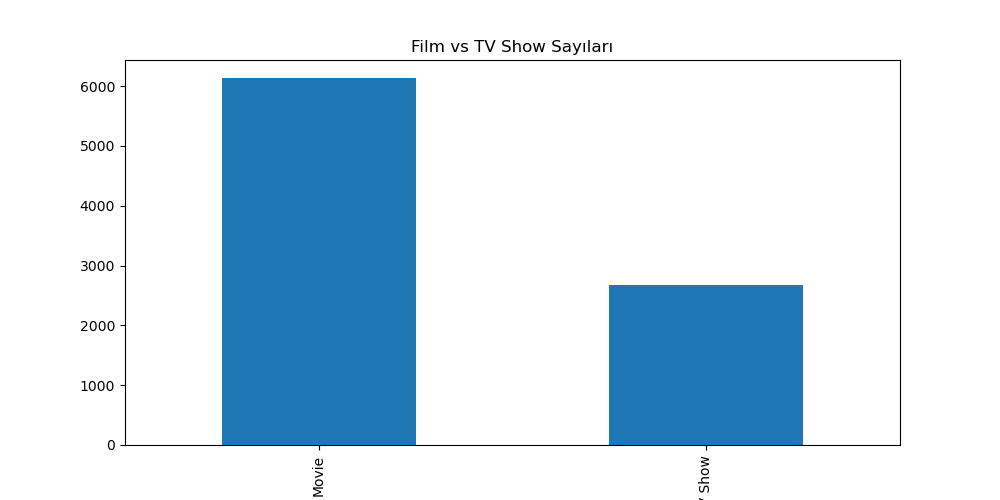
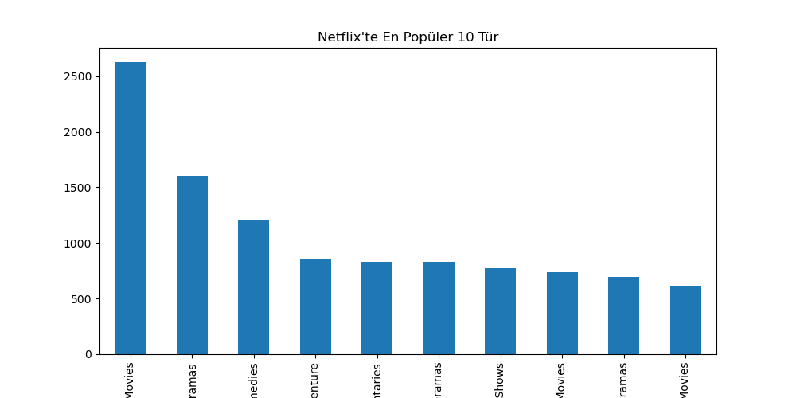
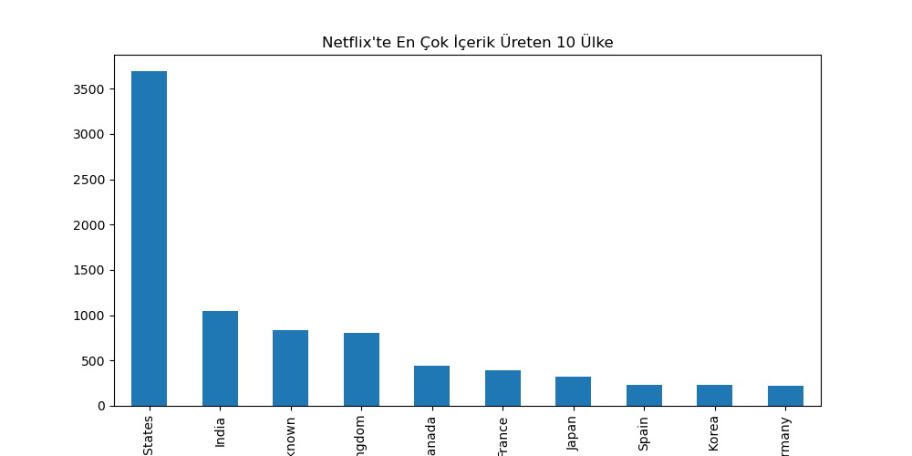
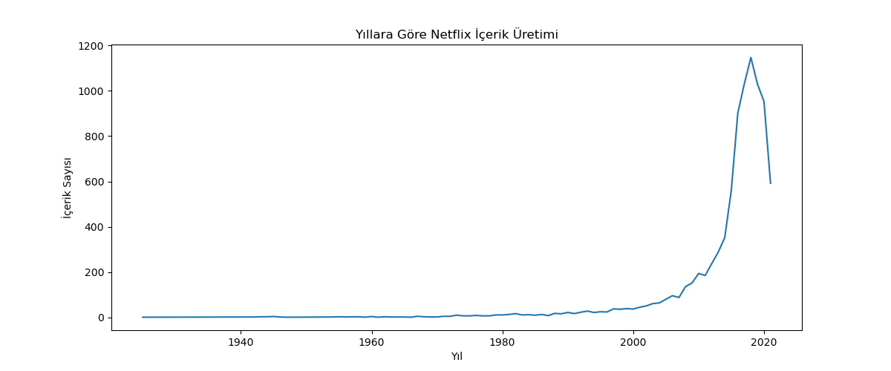
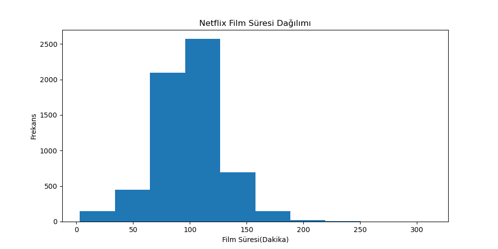

# 🎬 Netflix Veri Analizi Projesi  
### *Netflix içeriklerinin veri temizleme, analiz ve görselleştirme çalışması*

---

## 📌 Proje Hakkında

Bu proje, Netflix platformundaki **film ve dizi içeriklerini analiz etmek**, içerik türleri, ülkeler, süreler ve yıllara göre dağılımlar hakkında anlamlı çıkarımlar yapmak amacıyla hazırlanmıştır.  
Veri bilimi sürecinin temel adımları olan **veri temizleme, dönüştürme, keşifsel veri analizi (EDA) ve görselleştirme** uygulamalı olarak gerçekleştirilmiştir.

Bu çalışma, hem portföy hem de Python veri analizi pratiği niteliğindedir.

---

## 🎯 Projenin Amaçları

Bu projede yanıt aranan temel sorular:

- Netflix'te **film mi yoksa dizi mi** daha fazla?
- En çok içerik üretilen **türler** hangileri?
- Hangi **ülkeler** Netflix’e en fazla içerik sağlıyor?
- Netflix içerik üretimi **yıllar içinde nasıl değişmiş?**
- Filmlerin süreleri nasıl dağılıyor?
- Diziler genellikle kaç sezondan oluşuyor?

---

## 🗂️ Kullanılan Veri Seti

**Kaynak:** Kaggle – Netflix Movies and TV Shows Dataset  
İçerik sayısı: ~8800  
Sütunlar:  
- Başlık  
- Tür (Movie / TV Show)  
- Ülke  
- Yönetmen / Oyuncular  
- Yayın yılı  
- Netflix’e eklenme tarihi  
- Derecelendirme  
- Süre  
- Açıklama  

---

## 🧼 Veri Temizleme ve Dönüştürme Adımları

Veri seti üzerinde aşağıdaki işlemler uygulanmıştır:

### ✔ Eksik değerlerin doldurulması  
`director`, `cast`, `country`, `rating`, `duration` gibi sütunlardaki boş değerler `"Unknown"` ile dolduruldu.

### ✔ Ülke ve tür sütunlarının parçalanması  
- `listed_in` → türlerin virgüllerle ayrılması  
- `country` → birden fazla ülke varsa ayrıştırılması  
- `explode()` ile alt satırlara açılması  

### ✔ Film sürelerinin dönüştürülmesi  
Örnek: `"90 min"` → `90` (integer)

### ✔ Dizi sezon sayılarının dönüştürülmesi  
Örnek: `"3 Seasons"` → `3`  
`"1 Season"` → `1`

### ✔ Boşlukların temizlenmesi  
`str.strip()` ile tür ve ülke adlarındaki boşluklar kaldırıldı.

Bu adımlar analizlerin doğruluğu için kritik öneme sahiptir.

---

## 📊 Yapılan Analizler ve Görseller

### 🎬 Film vs Dizi Dağılımı
Netflix’in içerik yapısı ağırlıklı olarak **filmlerden oluşuyor**.



---

### 🎭 En Popüler 10 Tür
En fazla içerik üretilen türler listelenmiştir.



---

### 🌍 En Çok İçerik Üreten 10 Ülke
ABD ve Hindistan açık ara öndedir.



---

### 📈 Yıllara Göre İçerik Artışı
Özellikle **2015 sonrası** içerik üretiminde ciddi bir sıçrama görülmektedir.



---

### ⏱ Film Süresi Dağılımı
- Ortalama film süresi: ~100 dk  
- Yoğunluk 90–120 dk aralığında  



---

### 📺 Dizi Sezon Sayısı Dağılımı
Netflix dizilerinin çoğu **1–2 sezon**dur.


---

## 🧠 Çıkarımlar / Sonuçlar

Bu analiz sonucunda Netflix kataloğuna dair önemli bulgular elde edilmiştir:

- Netflix içerikleri ağırlıklı olarak **film** formatındadır.  
- **Uluslararası içeriklerin** (özellikle Hindistan ve İngiltere) sayısı dikkat çekici biçimde artmaktadır.  
- Katalogdaki filmlerin büyük bölümü **90–120 dakika** bandındadır.  
- Diziler çoğunlukla kısa sezon yapısına sahiptir.  
- İçerik üretimi, dijital platformların yükselişiyle paralel olarak, **2016–2020 arasında büyük bir ivme** kazanmıştır.

Bu çalışma, veri bilimi uygulamalarını gerçek bir veri kümesi üzerinde deneyimleme açısından güçlü bir örnektir.

---

## 🚀 Projenin Çalıştırılması

```bash
pip install -r requirements.txt
python src/main.py


